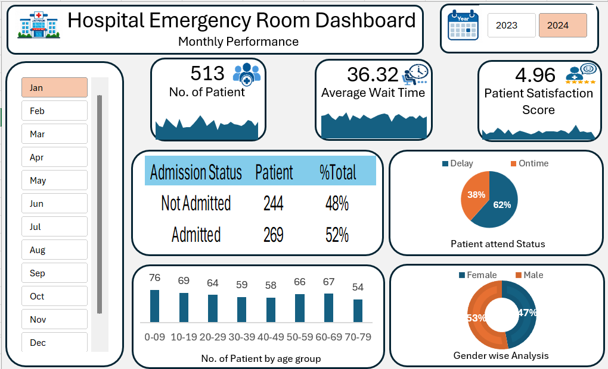

# 🏥 Hospital Emergency Room Analytics Dashboard | Excel

> An end-to-end Business Intelligence project built in Microsoft Excel to transform emergency-room data into interactive KPIs, operational trends, and business insights.


---

## 📸 Dashboard Preview



---

# 📌 Project Overview

The **Hospital Emergency Room Analytics Dashboard** is an interactive Excel-based Business Intelligence project developed to analyze emergency-room operations and patient experience.

The project transforms raw hospital data into a structured analytical solution using:

- Microsoft Excel
- Power Query
- Power Pivot
- DAX
- Pivot Tables
- Pivot Charts
- Slicers
- Dashboard visualizations

The dashboard provides a consolidated view of:

- Patient volume
- Average waiting time
- Patient satisfaction
- Admission status
- Patient attendance/timeliness
- Age distribution
- Gender distribution
- Department referrals
- Daily performance trends

---

# 🚨 Business Problem

Emergency rooms need to manage changing patient demand while maintaining efficient patient flow and a good patient experience.

However, raw patient-level data can make it difficult for stakeholders to quickly answer important operational questions.

### Key challenges

- How many patients are visiting the emergency room?
- What is the average patient waiting time?
- How many patients are attended within the expected 30-minute threshold?
- What percentage of patients are admitted?
- Which age groups contribute the most patients?
- What is the gender distribution?
- Which departments receive the highest referrals?
- How does patient volume change from day to day?
- How does patient satisfaction change over time?

### Business Need

A centralized dashboard was required to convert raw data into a simple and interactive reporting solution that could help stakeholders monitor performance and identify areas requiring attention.

---

# 🎯 Project Objectives

The dashboard was developed to:

1. Monitor total emergency-room patient volume.
2. Analyze average patient waiting time.
3. Track patient satisfaction.
4. Compare admitted and non-admitted patients.
5. Measure patient attendance against a 30-minute threshold.
6. Analyze patient age groups.
7. Analyze gender distribution.
8. Identify department referral patterns.
9. Monitor daily trends.
10. Provide year and month filtering.
11. Generate business insights from the analysis.

---

# ❓ Business Questions

## Patient Operations

- How many patients visited the ER?
- Which periods have higher patient volume?
- What is the average waiting time?
- Which days show higher waiting times?

## Patient Experience

- What is the average patient satisfaction score?
- How does satisfaction change over time?
- Can satisfaction trends be reviewed alongside waiting time and patient volume?

## Admission

- How many patients were admitted?
- How many were not admitted?
- What percentage of patients were admitted?

## Timeliness

- How many patients were attended within 30 minutes?
- What percentage of patients experienced delays?

## Demographics

- Which age groups have the highest patient volume?
- What is the gender distribution?

---

# 🛠️ Tools & Technologies

| Tool | Purpose |
|---|---|
| **Microsoft Excel** | Dashboard development and reporting |
| **Power Query** | Data import, transformation and cleaning |
| **Power Pivot** | Data modeling and relationships |
| **DAX** | Analytical calculations |
| **Pivot Tables** | Data aggregation |
| **Pivot Charts** | Data visualization |
| **Slicers** | Interactive filtering |

---

# 🔄 End-to-End Project Workflow

```text
Business Requirement Gathering
            ↓
Understanding the Data
            ↓
Data Connection & Import
            ↓
Power Query Transformation
            ↓
Data Cleaning & Quality Check
            ↓
Calendar Table Creation
            ↓
Power Pivot Data Modeling
            ↓
DAX Calculations
            ↓
Pivot Tables
            ↓
Charts Development
            ↓
Dashboard Layout & Formatting
            ↓
Interactive Slicers
            ↓
Validation
            ↓
Insights Generation
            ↓
Final Dashboard
